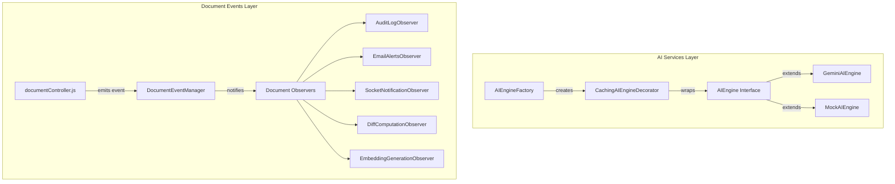

# LivePDF — Design Patterns Implementation & Optimization Guide

This document explains the integration of design patterns into the LivePDF server architecture. We have chosen three key patterns from our catalog to optimize performance, cache resource-intensive operations, and decouple event-driven side effects.

---

## Architecture Overview

---

## 1. Chosen Design Patterns

### 1.1 Creational: Factory Method Pattern (`AIEngineFactory`)
* **Core Benefit**: Decouples the application from concrete SDK imports (such as Google GenAI).
* **Optimization**: The codebase queries a single interface. If `GEMINI_API_KEY` is not present, the factory returns a mock engine instantly without loading or calling third-party SDK clients, saving memory and preventing configuration crashes.

### 1.2 Structural: Decorator Pattern (`CachingAIEngineDecorator`)
* **Core Benefit**: Adds database caching logic transparently to the AI service.
* **Optimization**: Intercepts summary generation requests. By reading/writing from the `ai_summaries` table before executing LLM prompts, it prevents redundant external API calls, resulting in **direct cost savings** and faster performance.

### 1.3 Behavioral: Observer Pattern (`DocumentEventManager`)
* **Core Benefit**: Decouples document upload side-effects from the main HTTP route.
* **Optimization**: The upload controller emits a single `document:updated` event and returns an immediate response to the client. Long-running tasks (diffing, embedding calculation, email queueing) run asynchronously in their own handlers, keeping the API highly responsive.

---

## 2. Implementation Phases

### **Phase 1: AI Services Refactoring (Creational & Structural)**
We split the inline AI methods into dedicated classes and introduce the factory and decorator:
* `server/src/services/ai/AIEngine.js` — Interface defining the contract.
* `server/src/services/ai/GeminiAIEngine.js` — Google GenAI SDK integration.
* `server/src/services/ai/MockAIEngine.js` — Local offline fallback logic.
* `server/src/services/ai/CachingAIEngineDecorator.js` — Database cache interceptor.
* `server/src/services/ai/AIEngineFactory.js` — Factory builder.
* `server/src/services/aiService.js` — Delegator (retains backward compatibility).

### **Phase 2: Document Processing Events (Behavioral)**
We refactor post-upload tasks to run via event subscribers:
* `server/src/services/documentEventManager.js` — Event emitter registry.
* `server/src/services/observers/documentObservers.js` — Registered event handlers.
* `server/src/controllers/documentController.js` — Streamlined controller that publishes upload events.
* `server/src/index.js` — Startup listener registration import.

---

## 3. How to Run & Verify

1. **AI Caching and Factory**:
   * Run the server without a `GEMINI_API_KEY`. It should default to mock summaries cleanly.
   * Add a `GEMINI_API_KEY`. Request a summary for a specific version. Verify that the first request logs an API hit, and subsequent requests return from the cache.

2. **Document Event Observers**:
   * Upload a new version of a document.
   * Verify in the console logs that Audit Logs, Email Queuing, WebSockets, Python Diff Service, and Vector Embedding generations all execute asynchronously in their own handlers.
